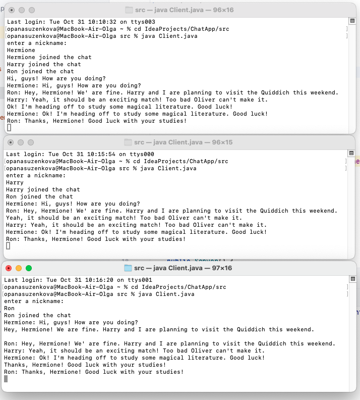
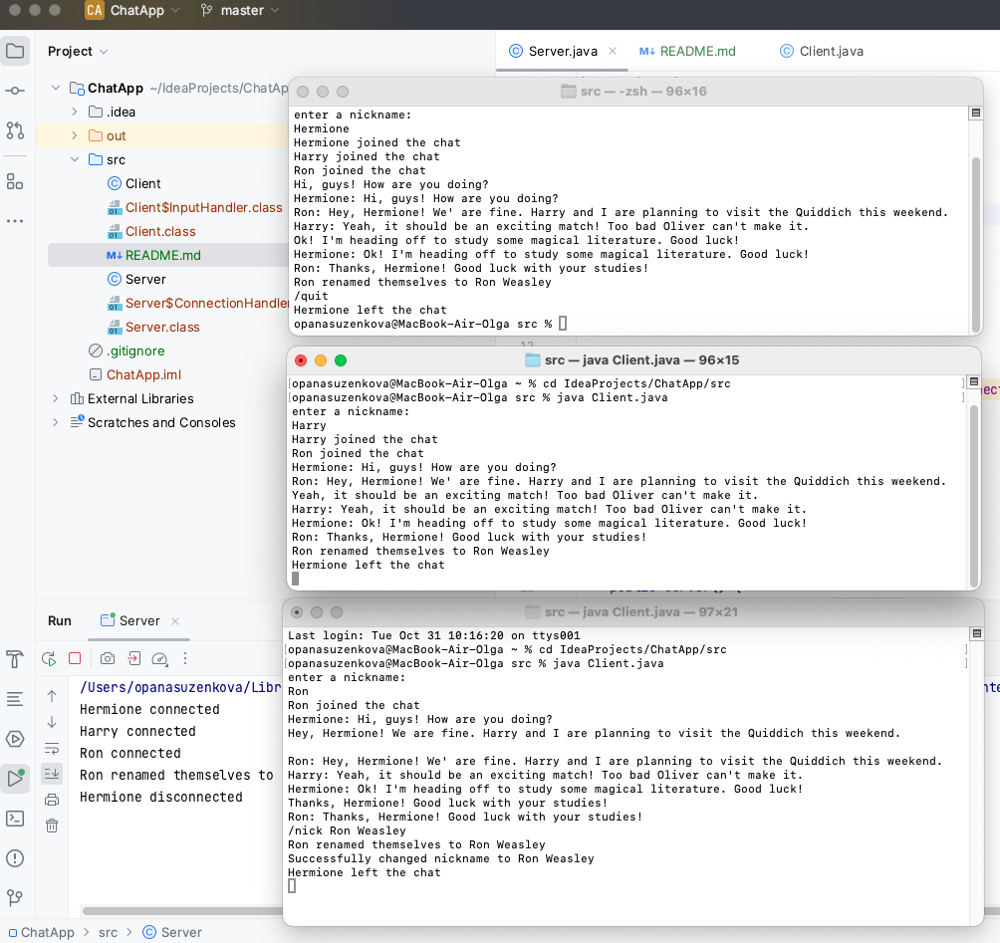

# Multithreading TCP Chat

----

+ [О проекте](#О-проекте)
+ [Технологии](#Технологии)
+ [Использование](#Использование)

## О проекте

Многопользовательский чат, разработанный с использованием TCP-протокола для обмена
сообщениями между клиентами и сервером. Чат обеспечивает возможность мгновенного
общения пользователей через сеть.

## Технологии

----

+ Сборщик проектов **Maven**;
+ Backend - **Java 20**, **OOP**, **Collections**;
+ Сеть - **Java Networking**;
+ GUI - **JavaFX** (в разработке)

## Использование

Пример общения трех пользователей:

Возможность изменения никнейма по команде `/nick` и
выход из чата `/quit`

